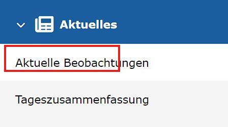
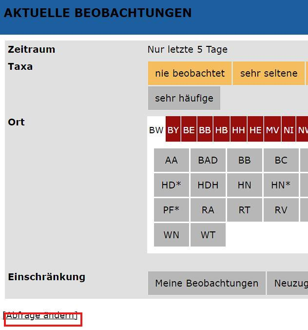
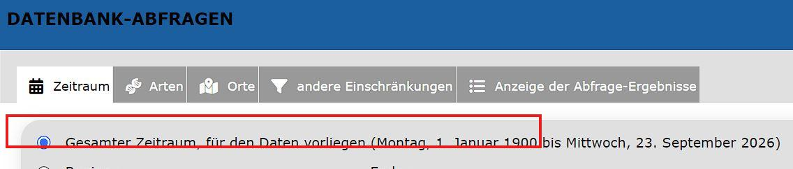
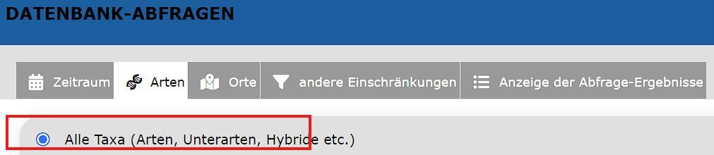
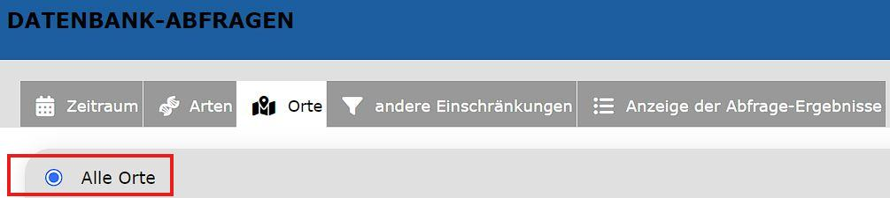
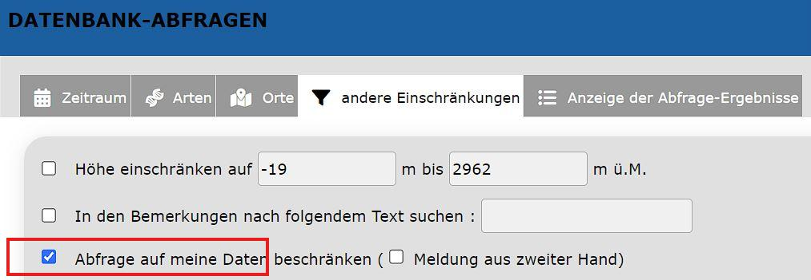
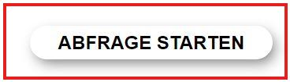
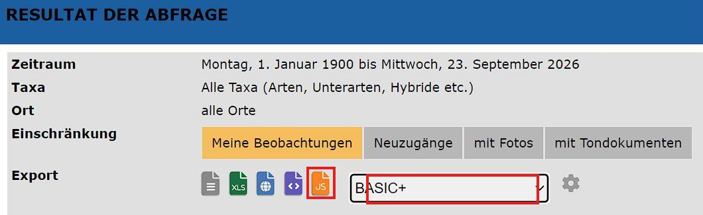

# Datenexport von ornitho.de

Kurzanleitung, wie du deinen Beobachtungsexport für [`lifelist.py`](lifelist.py) von [ornitho.de](https://www.ornitho.de/) herunterlädst. Die markierten Schaltflächen zeigen, worauf du in jedem Schritt klickst.

1. Im Menü unter **Aktuelles** auf **Aktuelle Beobachtungen** klicken.

   

2. Unten auf **Abfrage ändern** klicken.

   

3. Im Tab **Zeitraum** die Option **Gesamter Zeitraum, für den Daten vorliegen** wählen.

   

4. Im Tab **Arten** **Alle Taxa** auswählen.

   

5. Im Tab **Orte** **Alle Orte** auswählen.

   

6. Im Tab **andere Einschränkungen** die Haken bei **Abfrage auf meine Daten beschränken** setzen (die anderen Felder bleiben leer).

   

7. Auf **Abfrage starten** klicken.

   

8. Im Ergebnis das Export-Format von **BASIC** auf **BASIC+** umstellen.
9. Auf das orangene **JS**-Symbol klicken, um die Datei herunterzuladen.

   

Die heruntergeladene Datei (`export_*.json`) neben `lifelist.py` legen und wie in der [README](README.md#verwendung) beschrieben weiterverwenden.
