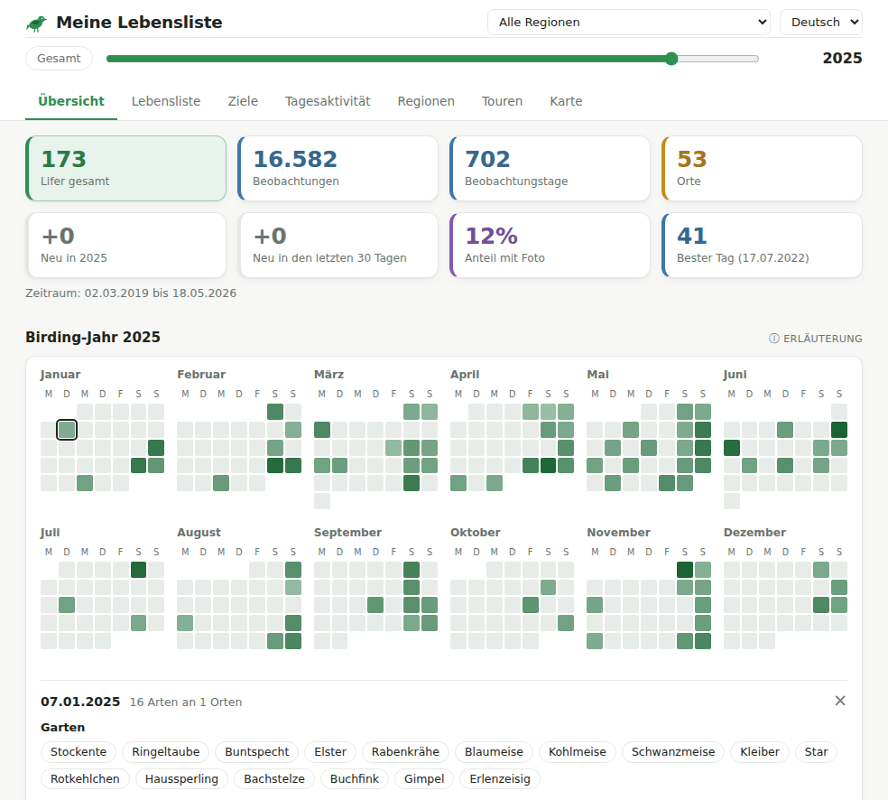
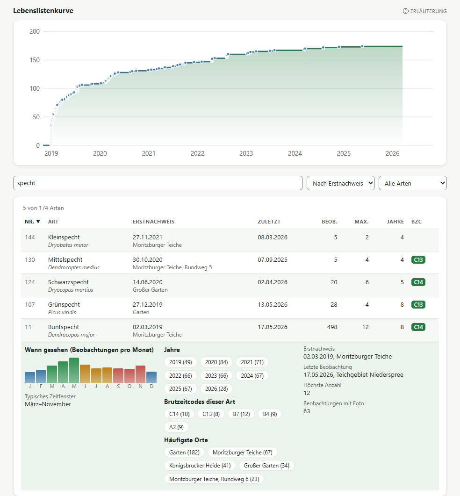
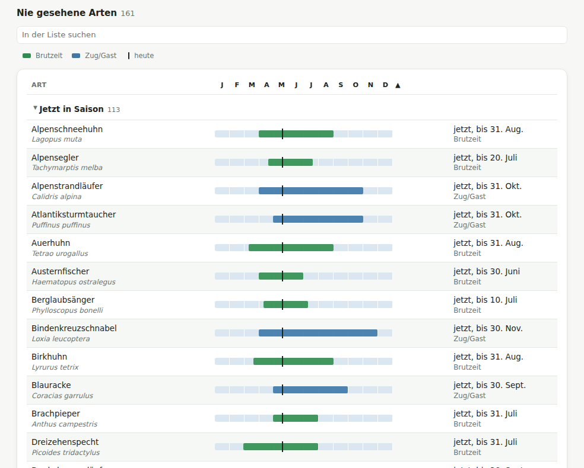
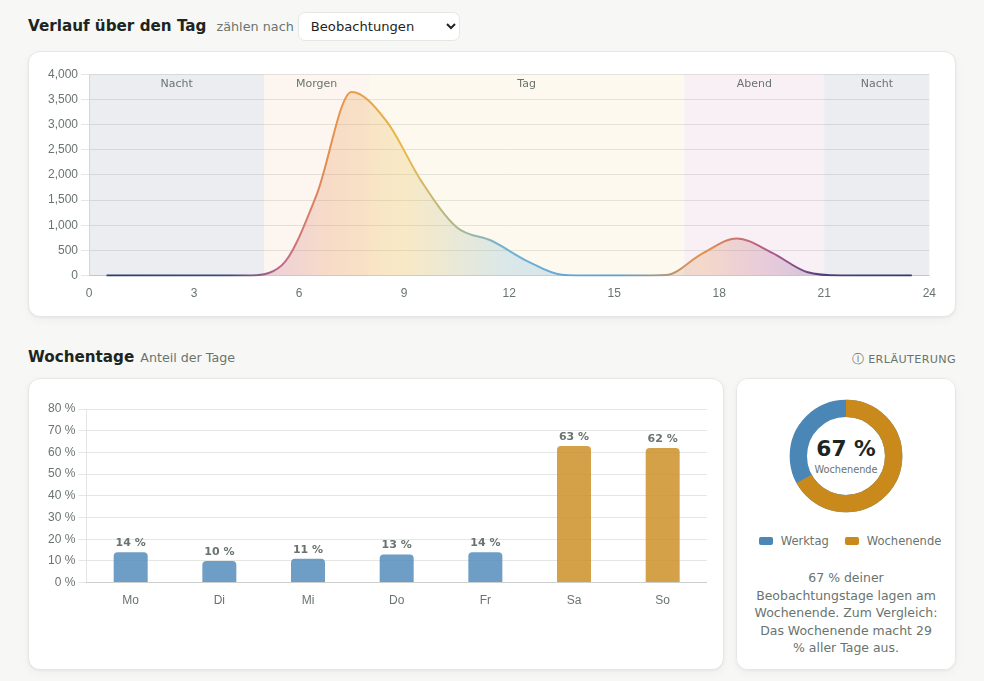
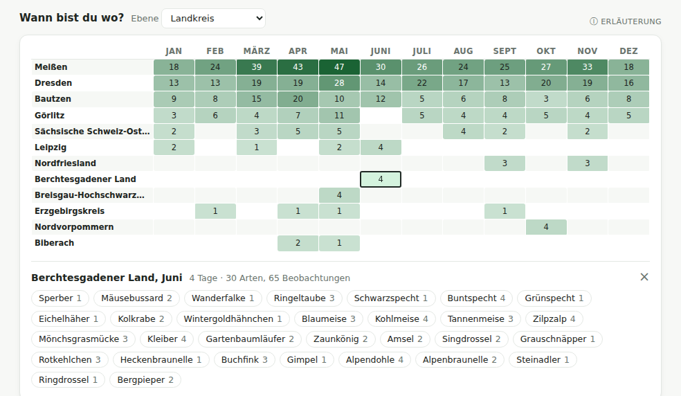
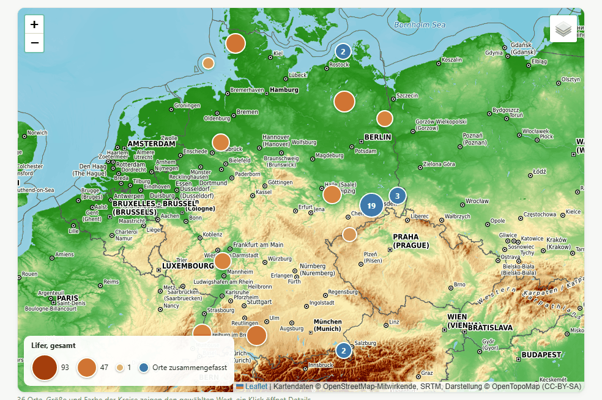
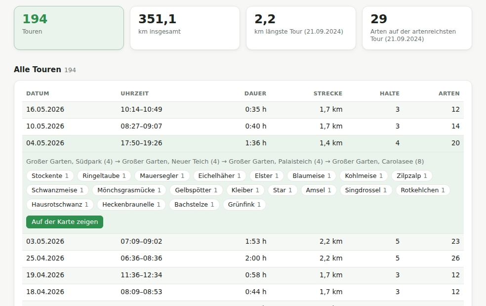
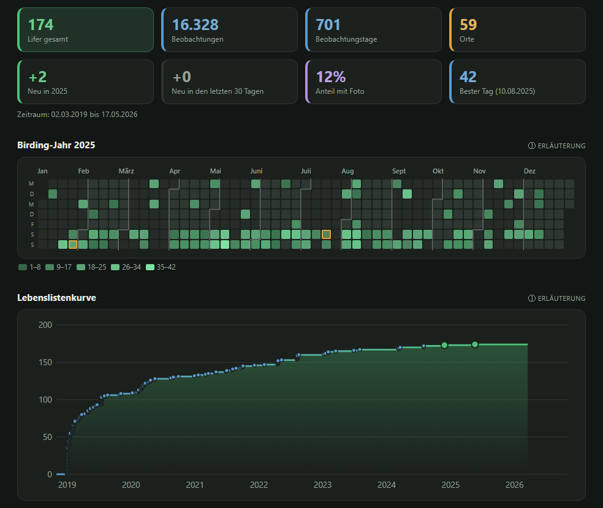
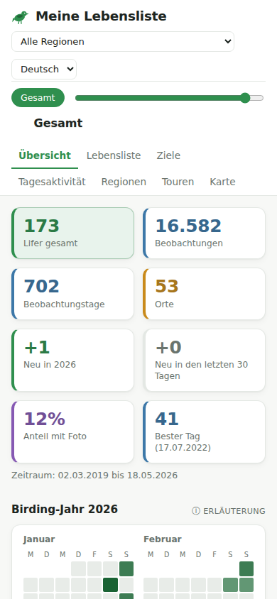

# OrnithoLifeList

Macht aus deinem [ornitho.de](https://www.ornitho.de/)-Export eine interaktive Vogel-Lebensliste: eine einzige HTML-Datei, die du direkt im Browser öffnest, ohne Server und ohne Installation.

## Was zeigt die Lebensliste?

- **Übersicht:** Kennzahlen, Kalender deines Birding-Jahres, Lebenslistenkurve, neueste Lifer, Arten pro Jahr und Monat
- **Lebensliste:** alle Arten, durchsuchbar und sortierbar, mit Details zu jeder Art
- **Ziele:** Arten, die dir noch fehlen, mit Saisonhinweis, wann sie hier vorkommen, und eigener Wunschliste
- **Tagesaktivität:** zu welcher Uhrzeit, an welchen Wochentagen und in welchen Monaten du unterwegs bist
- **Regionen:** Arten nach Bundesland, Landkreis, Gemeinde und Ort, und wann du dich wo aufhältst
- **Touren:** Spaziergänge und Radtouren, rekonstruiert aus Meldungen, die zeitlich und räumlich nah beieinanderliegen, mit Strecke auf der Karte
- **Karte** deiner Beobachtungsorte

Fast alles ist anklickbar: ein Tag im Kalender, eine Zelle in einer Tabelle oder ein Punkt auf der Kurve zeigt die Arten dahinter, und jede Art führt zu ihrem Eintrag in der Lebensliste. Die Seite gibt es auf Deutsch und Englisch (mit englischen Artnamen), hell und dunkel, und sie lässt sich als PDF speichern.

## So sieht es aus

Die Bilder zeigen eine Lebensliste aus erfundenen Beispieldaten.

**Übersicht** mit Kennzahlen und Kalender; ein Klick auf einen Tag zeigt, was wo beobachtet wurde:



**Lebensliste** mit Kurve, Suche und den Details einer Art:



**Ziele:** Arten, die noch fehlen, mit ihrer Saison:



**Tagesaktivität** über den Tag und nach Wochentagen:



**Regionen:** wann du dich wo aufhältst, mit den Arten einer Zelle:



**Karte** aller Beobachtungsorte, Größe und Farbe nach Artenzahl:



**Touren**, zusammengesetzt aus Meldungen, die höchstens 10 Minuten und 1 km auseinanderliegen:



**Dunkles Design** und **Handy**:

<p> </p>

## Schnellstart

1. **Export herunterladen:** Auf ornitho.de einen JSON-Export deiner Beobachtungen erstellen. Wie das geht, zeigt die [bebilderte Anleitung](HOWTO.md).
2. **Datei ablegen:** Die heruntergeladene Datei (zum Beispiel `export_12345_67890_20260919_002546.json`) in denselben Ordner wie `lifelist.py` legen.
3. **Lebensliste erstellen:** In diesem Ordner ausführen:

   ```bash
   python lifelist.py
   ```

4. **Öffnen:** Die neue Datei `lifelist.html` im Browser öffnen.

Liegen mehrere `export_*.json` im Ordner, nimmt das Programm automatisch die neueste.

Du brauchst dafür nur Python 3. Ohne Python geht es unter Windows mit der fertigen `lifelist.exe`, siehe [unten](#ohne-python-lifelistexe-für-windows).

## Optionen

| Aufruf | Was passiert |
| --- | --- |
| `python lifelist.py` | erstellt `lifelist.html` aus dem neuesten Export |
| `python lifelist.py --source export_….json` | nimmt genau diese Exportdatei |
| `python lifelist.py --redact` | erstellt `lifelist_redacted.html` ohne Ortsangaben, zum Weitergeben |
| `python lifelist.py --check-update` | sieht auf GitHub nach, ob es eine neuere Version gibt, und erstellt nichts |
| `python lifelist.py --version` | zeigt die installierte Version |

In der Version mit `--redact` fehlen Beobachtungsorte, Gemeinden, Koordinaten, die Karte und die Touren. Alle Arten, Daten und Auswertungen bleiben erhalten.

## Ohne Python: lifelist.exe für Windows

Auf der [Releases-Seite](../../releases) gibt es eine fertige `lifelist.exe`. Sie macht dasselbe wie `python lifelist.py` und versteht dieselben Optionen. Lege sie wie oben beschrieben in denselben Ordner wie deinen Export und starte sie per Doppelklick.

**Vor dem ersten Start prüfen, ob die Datei echt ist:** Lade vom Release auch `lifelist.exe.sha256`, `verify.bat` und `verify.ps1` in denselben Ordner und starte `verify.bat` per Doppelklick. Es vergleicht die Prüfsumme (SHA256) der exe mit der veröffentlichten und meldet „OK“ oder eine Warnung. Fehlt die `.sha256`-Datei, fragt es nach der Prüfsumme aus den Release-Notizen. Bei einer Warnung die exe nicht starten: Sie stammt dann nicht aus diesem Release.

Ohne die Skripte geht es auch von Hand in PowerShell: `Get-FileHash lifelist.exe -Algorithm SHA256` ausführen und das Ergebnis mit der Prüfsumme auf der Releases-Seite vergleichen.

## Aktualisieren

- **Mit git** (Projekt per `git clone` heruntergeladen): `python update.py` ausführen, unter Windows reicht ein Doppelklick auf `update.bat`. Das Skript holt die neue Version von GitHub und zeigt, was sich geändert hat. Deine Exporte und HTML-Dateien bleiben unberührt. Hast du Dateien des Programms selbst geändert (zum Beispiel die Screenshots neu erzeugt), nennt das Skript sie und fragt, ob es die Änderungen verwerfen soll. Ohne ein „y“ überschreibt es nichts. Deine eigenen neuen Dateien bleiben in jedem Fall erhalten.
- **Ohne git:** die neue Version von der [Releases-Seite](../../releases) herunterladen.

Ob es eine neue Version gibt, zeigt `python lifelist.py --check-update`.

## Datenschutz und Internet

- Das Erstellen der Lebensliste läuft komplett auf deinem Rechner und geht nie ins Internet.
- Die fertige Seite funktioniert offline, nur die Karte lädt ihre Kartenkacheln aus dem Internet.
- `--check-update` und `update.py` fragen GitHub nach der neuesten Version. Dabei werden keine Beobachtungsdaten gesendet.
- Deine eigene Wunschliste (Tab „Ziele“) speichert nur dein Browser. Sie bleibt erhalten, wenn du die Lebensliste neu erstellst. Zum Sichern oder für einen anderen Rechner kannst du sie dort als Datei speichern und wieder laden.
- Export und HTML-Dateien enthalten deine Beobachtungsorte. Sie sind per `.gitignore` vom Git-Repository ausgeschlossen. Zum Weitergeben ist die Version mit `--redact` gedacht; ihr fehlen auch Karte und Touren.

## Woher kommen die Artdaten?

- **Artnamen** (deutsch, wissenschaftlich, englisch) stammen aus der offiziellen ornitho-Artenliste.
- **Saisonhinweise** auf der Wunschliste:
  - Für Arten, die in Deutschland oder Luxemburg brüten, gilt das offizielle Brutzeitfenster von ornitho.de.
  - Für Zug- und Gastvögel, die hier nicht brüten, wird ein typischer Beobachtungszeitraum aus öffentlichen Fundmeldungen bei [GBIF](https://www.gbif.org/) abgeleitet.

Beides steckt fertig aufbereitet in `species_reference.json`.

## Für Entwickler

### Projektaufbau

| Datei / Ordner | Inhalt |
| --- | --- |
| `lifelist.py` | liest den Export und erstellt die HTML-Seite |
| `template.html` | Vorlage der Seite (HTML und CSS) mit den Platzhaltern `__DATA_JSON__`, `__APP_JS__`, `__VENDOR_JS__`, `__VENDOR_CSS__` |
| `src/*.js` | JavaScript der Seite, aufgeteilt nach Tab und Thema (`counties.js`: Namen der Landkreise zu ornithos Kreiskürzeln) |
| `vendor/` | mitgelieferte Bibliotheken Leaflet, Leaflet.markercluster und Chart.js |
| `species_reference.json` | Artnamen und Saisonzeiträume |
| `tests/` | automatische Tests mit erfundenen Beispieldaten |
| `update.py`, `update.bat` | aktualisieren eine git-Kopie |
| `build.py`, `build.bat`, `lifelist.spec` | bauen die `lifelist.exe` |
| `.github/workflows/release.yml` | baut die exe und veröffentlicht das Release, sobald ein Versions-Tag gepusht wird |
| `verify.ps1`, `verify.bat` | prüfen die Prüfsumme der `lifelist.exe` |
| `tools/` | Werkzeuge zur Pflege der Referenzdaten und Bibliotheken, für Beispieldaten und Screenshots |
| `docs/screenshots/` | Bilder für diese README |
| `HOWTO.md`, `howto/` | Anleitung zum Export mit Screenshots |

### Aufbau des JavaScript

Die Aufteilung in `src/*.js` dient nur der Bearbeitung. `lifelist.py` fügt die Dateien in fester Reihenfolge (`APP_JS_FILES`) zu einem einzigen `<script>` zusammen, ausgeliefert wird immer nur die eine HTML-Datei. Echte Module mit `import`/`export` gibt es bewusst nicht: `<script type="module">` scheitert unter `file://` an der CORS-Sperre von Chrome.

Optional lässt sich der Code anhand seiner JSDoc-Kommentare mit dem TypeScript-Compiler prüfen, ohne dass TypeScript im ausgelieferten Code landet:

```bash
npx --package typescript -- tsc -p tsconfig.json
```

Einfaches `npx tsc` funktioniert nicht, weil ein fremdes npm-Paket namens `tsc` den echten Compiler verdeckt.

### Tests

```bash
python -m unittest discover -s tests -t .
```

Die Tests nutzen erfundene Beispieldaten aus `tests/fixtures.py` und überschreiben keine eigene `lifelist.html`.

- `tests/test_build.py` prüft die Datenaufbereitung und braucht nur Python.
- `tests/test_update.py` prüft `update.py` an Test-Repositories und braucht git.
- `tests/test_page.py` öffnet die Seite in einem unsichtbaren Chromium, klickt sich durch alle Tabs und Funktionen und meldet JavaScript-Fehler. Dafür wird Playwright gebraucht, sonst werden diese Tests übersprungen:

  ```bash
  pip install playwright
  playwright install chromium
  ```

### Ein Release veröffentlichen

1. Die Versionsnummer `APP_VERSION` in `src/i18n.js` erhöhen.
2. Die Release-Notizen nach `.github/release-notes/v<Version>.md` schreiben, zum Beispiel `v0.3.0.md`, und beides committen und pushen.
3. Auf GitHub im Tab **Actions** den Workflow **Release** mit **Run workflow** starten. Alternativ das Tag selbst pushen: `git tag v0.3.0 && git push origin v0.3.0`.

Den Rest erledigt GitHub Actions (`.github/workflows/release.yml`) auf einem Windows-Rechner: Es legt beim Start von Hand das Tag aus der Versionsnummer an (ein gepushtes Tag prüft es gegen die Versionsnummer), lässt die Tests laufen, baut die `lifelist.exe` und legt das Release an, mit `lifelist.exe`, `lifelist.exe.sha256`, `verify.bat` und `verify.ps1` und der Prüfsumme in den Notizen. Das Tag muss zur Versionsnummer passen, sonst meldet `--check-update` keine neue Version.

Zum Ausprobieren lässt sich die exe auch selbst bauen: unter Windows `python build.py` (oder `build.bat` doppelklicken), nach `pip install pyinstaller`. Das Skript lässt zuerst die Tests laufen und schreibt dann `dist\lifelist.exe` samt `dist\lifelist.exe.sha256`. PyInstaller baut immer für das System, auf dem es läuft.

### Beispieldaten und Screenshots

- `tools/make_demo_export.py` erzeugt einen erfundenen, aber realistisch wirkenden Export (`export_demo.json`): ein fiktiver Beobachter aus der Nähe von Dresden, über mehrere Jahre an echten Beobachtungsorten, mit Reisen quer durch Deutschland. Gut zum Ausprobieren ohne eigene Daten: `python tools/make_demo_export.py`, dann `python lifelist.py --source export_demo.json`.
- `tools/make_screenshots.py` erstellt daraus die Bilder in `docs/screenshots/` (braucht Playwright, siehe Tests). Mit `--map` kommt ein Bild der Karte dazu, dafür braucht es Internet für die Kartenkacheln.

### Welche Felder hat ein Export?

`python tools/export_fields.py` listet auf, welche Felder im neuesten `export_*.json` vorkommen, wie oft und mit welcher Art von Wert, und ob Meldungen eigene Koordinaten haben. Es gibt dabei keine Werte aus (keine Namen, Orte, Daten oder Koordinaten), die Ausgabe lässt sich also gefahrlos weitergeben, etwa um neue Funktionen zu planen.

### Referenzdaten und Bibliotheken pflegen

- `tools/extract_species_reference.py` aktualisiert `species_reference.json` aus der ornitho-Referenzliste (`reference/ornitho-Referenzliste-Arten-*.xlsx`, braucht `pip install openpyxl`). Der Ordner `reference/` ist wegen unklarer Weitergaberechte nicht im Repository.
- `tools/fetch_occurrence_windows.py` ermittelt die Beobachtungszeiträume der Zug- und Gastvögel über die öffentliche GBIF-API.
- `tools/update_vendor.py` lädt die Bibliotheken in `vendor/` neu, zum Beispiel für ein Versions-Update.

Für das normale Erstellen der Lebensliste werden diese Werkzeuge nicht gebraucht.

### Lizenzen der mitgelieferten Bibliotheken

- [Leaflet](https://leafletjs.com/): BSD-2-Clause, © Vladimir Agafonkin, © 2010–2023 CloudMade
- [Leaflet.markercluster](https://github.com/Leaflet/Leaflet.markercluster): MIT, © Dave Leaver
- [Chart.js](https://www.chartjs.org/): MIT, © Chart.js Contributors

Alle drei erlauben Einbettung und Weitergabe. Ihre Copyright-Hinweise bleiben in den Dateien in `vendor/` erhalten.

## Lizenz

MIT, siehe [LICENSE](LICENSE).
