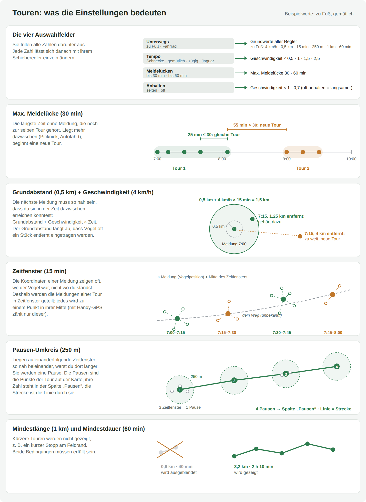

# ornithoLifeList

Macht aus deinem [ornitho.de](https://www.ornitho.de/)-Export eine interaktive Vogel-Lebensliste: eine einzige HTML-Datei, die du direkt im Browser öffnest, ohne Server und ohne Installation.

**[Demo herunterladen](../../releases/latest/download/lifelist-demo.html)**: eine fertige Lebensliste aus erfundenen Beispieldaten. Einfach im Browser öffnen und ausprobieren, ganz ohne eigenen Export.

## Was zeigt die Lebensliste?

- **Übersicht:** Kennzahlen, Kalender deines Birding-Jahres, Lebenslistenkurve, neueste Lifer, Arten pro Jahr und Monat
- **Lebensliste:** alle Arten, durchsuchbar und sortierbar, mit Details zu jeder Art
- **Ziele:** Arten, die dir noch fehlen, mit Saisonhinweis, wann sie hier vorkommen, eigener Wunschliste und den Ausnahmegästen der ornitho-Artenliste; dazu Reiseziele: wo und in welchem Monat du fehlende Arten am ehesten siehst (Deutschland nach Bundesland und Landkreis, Europa nach Land und Provinz, sobald die Daten dafür da sind)
- **Tagesaktivität:** zu welcher Uhrzeit, an welchen Wochentagen und in welchen Monaten du unterwegs bist
- **Regionen:** Arten nach Bundesland, Landkreis, Gemeinde und Ort, und wann du dich wo aufhältst
- **Touren:** Spaziergänge und Radtouren, rekonstruiert aus Meldungen, die zeitlich und räumlich nah beieinanderliegen, mit Strecke auf der Karte
- **Karte** deiner Beobachtungsorte, auch als Zeitraffer über ein Jahr

<details><summary>Wie die Touren entstehen: Schaubild der Einstellungen</summary>



</details>

Fast alles ist anklickbar: ein Tag im Kalender, eine Zelle in einer Tabelle oder ein Punkt auf der Kurve zeigt die Arten dahinter, und jede Art führt zu ihrem Eintrag in der Lebensliste. Die Seite gibt es auf Deutsch und Englisch (mit englischen Artnamen), hell und dunkel, und sie lässt sich als PDF speichern, wahlweise mit allen Reitern oder nur einzelnen (vorgewählt: Übersicht und Lebensliste).

## So sieht es aus

Die Bilder zeigen eine Lebensliste aus erfundenen Beispieldaten.

**Übersicht** mit Kennzahlen und Kalender; ein Klick auf einen Tag zeigt, was wo beobachtet wurde:


**Lebensliste** mit Kurve, Suche und den Details einer Art:


**Ziele:** Arten, die noch fehlen, mit ihrer Saison:


**Tagesaktivität** über den Tag und nach Wochentagen:


**Regionen:** wann du dich wo aufhältst, mit den Arten einer Zelle:


**Karte** aller Beobachtungsorte, Größe und Farbe nach Artenzahl:


**Touren**, zusammengesetzt aus Meldungen, die zeitlich und räumlich nah beieinanderliegen. Unter „Einstellungen“ wählst du, ob du zu Fuß oder mit dem Rad unterwegs warst und wie schnell (Schnecke bis Jaguar), und kannst jeden Wert mit einem Schieberegler anpassen:


**Dunkles Design** und **Handy**:

<p> </p>

## Schnellstart

1. **Export herunterladen:** Auf ornitho.de einen JSON-Export deiner Beobachtungen erstellen. Wie das geht, zeigt die [bebilderte Anleitung](HOWTO.md).
2. **Datei ablegen:** Die heruntergeladene Datei (zum Beispiel `export_12345_67890_20260919_002546.json`) in denselben Ordner wie `lifelist.py` legen.
3. **Lebensliste erstellen:** In diesem Ordner ausführen:

   ```bash
   python lifelist.py
   ```

4. **Öffnen:** Die neue Datei `lifelist.html` im Browser öffnen.

Liegen mehrere `export_*.json` im Ordner, wertet das Programm alle zusammen aus (siehe nächster Abschnitt).

Du brauchst dafür nur Python 3. Ohne Python geht es unter Windows mit der fertigen `lifelist.exe`, siehe [unten](#ohne-python-lifelistexe-für-windows).

## Export in mehrere Zeiträume aufteilen

Damit der ornitho.de-Server nicht bei jeder Aktualisierung den kompletten Beobachtungszeitraum exportieren muss, kann die Historie auf mehrere Exporte verteilt werden, zum Beispiel:

- einmalig je ein Export für die abgeschlossenen Jahre 2017, 2018, …, 2025
- ein Export für das laufende Jahr 2026, der bei Bedarf neu heruntergeladen wird

Beim Aktualisieren muss dann nur der Export des laufenden Jahres ersetzt werden; die alte Datei dieses Jahres einfach löschen. Zu Beginn des neuen Jahres wird der letzte Export des Vorjahres (mit Zeitraum bis 31.12.) zum festen Jahresexport, und ab dann wird nur noch das neue Jahr aktualisiert. Wie ein Teilzeitraum gewählt wird, steht in der [HOWTO.md](HOWTO.md).

`lifelist.py` liest alle `export_*.json` im Ordner und führt sie zusammen:

- Beobachtungen, die in mehreren Dateien enthalten sind (etwa bei sich überschneidenden Zeiträumen oder wenn noch ein alter Gesamtexport im Ordner liegt), werden anhand ihrer ornitho-Beobachtungsnummer nur einmal gezählt.
- Bei solchen Doppelten gilt der Stand aus dem neuesten Export, damit nachträgliche Korrekturen auf ornitho.de übernommen werden. Wann ein Export erstellt wurde, steht in seinem Dateinamen (`export_…_20260919_002546.json` = 19.09.2026, 00:25:46); nur bei anders benannten Dateien zählt das Änderungsdatum der Datei. Die Dateien deshalb möglichst nicht umbenennen.
- Eine auf ornitho.de gelöschte Beobachtung bleibt allerdings erhalten, solange sie noch in einer der Dateien steht. Veraltete Exporte, deren Zeitraum vollständig von neueren abgedeckt ist, deshalb löschen.

Die Ausgabe zeigt, welche Dateien gelesen wurden und wie viele doppelte Beobachtungen dabei aussortiert wurden.

## Optionen

| Aufruf | Was passiert |
| --- | --- |
| `python lifelist.py` | erstellt `lifelist.html` aus allen Exporten im Ordner |
| `python lifelist.py --source export_….json` | nimmt genau diese Exportdatei |
| `python lifelist.py --source archiv/*.json export_….json` | nimmt genau diese Exportdateien; `*` funktioniert auch unter Windows |
| `python lifelist.py --redact` | erstellt `lifelist_redacted.html` ohne Ortsangaben, zum Weitergeben |
| `python lifelist.py --check-update` | sieht auf GitHub nach, ob es eine neuere Version gibt, und erstellt nichts |
| `python lifelist.py --version` | zeigt die installierte Version |

In der Version mit `--redact` fehlen Beobachtungsorte, Gemeinden, Koordinaten, die Karte und die Touren. Alle Arten, Daten und Auswertungen bleiben erhalten, ebenso Bundesland und Landkreis; bei heiklen Arten (etwa Brutplätzen) können Art, Tag, Uhrzeit, Brutzeitcode und Landkreis zusammen noch viel verraten. Der Schalter „Ortsangaben schwärzen“ in den Einstellungen blendet die Orte nur aus: Die Datei enthält sie weiter, zum Weitergeben also immer die Version mit `--redact` erstellen.

## Ohne Python: lifelist.exe für Windows

Auf der [Releases-Seite](../../releases) gibt es eine fertige `lifelist.exe`. Sie macht dasselbe wie `python lifelist.py` und versteht dieselben Optionen. Lege sie wie oben beschrieben in denselben Ordner wie deinen Export und starte sie per Doppelklick.

**Vor dem ersten Start prüfen, ob die Datei echt ist:** Lade vom Release auch `lifelist.exe.sha256`, `verify.bat` und `verify.ps1` in denselben Ordner und starte `verify.bat` per Doppelklick. Es vergleicht die Prüfsumme (SHA256) der exe mit der veröffentlichten und meldet „OK“ oder eine Warnung. Fehlt die `.sha256`-Datei, fragt es nach der Prüfsumme aus den Release-Notizen. Bei einer Warnung die exe nicht starten: Sie stammt dann nicht aus diesem Release.

**Warnung von Windows (SmartScreen):** Beim ersten Start meldet Windows unter Umständen „Der Computer wurde durch Windows geschützt“. Das liegt daran, dass die `lifelist.exe` nicht digital signiert ist und noch nicht weit verbreitet; über den Inhalt sagt es nichts. Prüfe die Datei erst mit `verify.bat` (siehe oben), klicke dann in der Meldung auf „Weitere Informationen“ und auf „Trotzdem ausführen“. Alternativ vorher einen Rechtsklick auf die Datei, „Eigenschaften“ und unten „Zulassen“ ankreuzen: Dann fragt Windows nicht mehr nach.

Ohne die Skripte geht es auch von Hand in PowerShell: `Get-FileHash lifelist.exe -Algorithm SHA256` ausführen und das Ergebnis mit der Prüfsumme auf der Releases-Seite vergleichen.

## Aktualisieren

- **Mit git** (Projekt per `git clone` heruntergeladen): `python update.py` ausführen, unter Windows reicht ein Doppelklick auf `update.bat`. Das Skript holt die neue Version von GitHub und zeigt, was sich geändert hat. Deine Exporte und HTML-Dateien bleiben unberührt. Hast du Dateien des Programms selbst verändert, nennt das Skript sie und fragt, bevor es sie ersetzt. Ohne ein „y“ überschreibt es nichts.
- **Ohne git:** die neue Version von der [Releases-Seite](../../releases) herunterladen.

Ob es eine neue Version gibt, zeigt `python lifelist.py --check-update`. Was sich in jeder Version geändert hat, steht im [CHANGELOG](CHANGELOG.md).

## Datenschutz und Internet

- Das Erstellen der Lebensliste läuft komplett auf deinem Rechner und geht nie ins Internet.
- Die fertige Seite funktioniert offline, nur die Karte lädt ihre Kartenkacheln aus dem Internet.
- `--check-update` und `update.py` fragen GitHub nach der neuesten Version. Dabei werden keine Beobachtungsdaten gesendet.
- Deine eigene Wunschliste (Tab „Ziele“) speichert nur dein Browser. Sie bleibt erhalten, wenn du die Lebensliste neu erstellst. Zum Sichern oder für einen anderen Rechner kannst du sie dort als Datei speichern und wieder laden.
- Dein Export und die fertige `lifelist.html` enthalten deine Beobachtungsorte, bei Handy-Meldungen auch deinen GPS-Standort. Gib sie deshalb nur weiter, wenn das in Ordnung ist. Zum Teilen, etwa per Mail oder im Verein, gibt es die Version mit `--redact` (siehe [Optionen](#optionen)).
- Ein Update mit `update.bat` oder `update.py` lässt deinen Export und deine HTML-Dateien unangetastet.

## Woher kommen die Artdaten?

- **Artnamen** (deutsch, wissenschaftlich, englisch) stammen aus der offiziellen ornitho-Artenliste.
- **Saisonhinweise** auf der Wunschliste:
  - Für Arten, die in Deutschland oder Luxemburg brüten, gilt das offizielle Brutzeitfenster von ornitho.de.
  - Für Zug- und Gastvögel, die hier nicht brüten, wird ein typischer Beobachtungszeitraum aus öffentlichen Fundmeldungen bei [GBIF](https://www.gbif.org/) abgeleitet.

- **Reiseziele** und die Monate der **Ausnahmegäste:** öffentliche Beobachtungen bei [GBIF](https://www.gbif.org/) (Quelle: GBIF.org), nur Datensätze unter CC0 oder CC BY. Das Abrufdatum steht im Infotext der Reiseziele.

Alle diese Daten sind in der Lebensliste schon enthalten; beim Erstellen wird nichts aus dem Internet geladen.

## Mitmachen

Fehler gefunden oder eine Idee? Schreib ein [Issue](../../issues) auf GitHub. Wer selbst am Code mitarbeiten möchte, findet in [CONTRIBUTING.md](CONTRIBUTING.md), wie das Projekt aufgebaut ist, wie man die Tests startet und wie ein Pull Request abläuft.

## Lizenzen der mitgelieferten Bibliotheken

- [Leaflet](https://leafletjs.com/): BSD-2-Clause, © 2010–2023 Vladimir Agafonkin, © 2010–2011 CloudMade
- [Leaflet.markercluster](https://github.com/Leaflet/Leaflet.markercluster): MIT, © 2012 David Leaver
- [Chart.js](https://www.chartjs.org/): MIT, © Chart.js Contributors

Alle drei erlauben Einbettung und Weitergabe, solange der Copyright- und Lizenzhinweis mitgeht. Er steht am Anfang der Dateien in `vendor/` und kommt damit in jede erzeugte Lebensliste und in die `lifelist.exe`.

## Lizenz

MIT, siehe [LICENSE](LICENSE).
